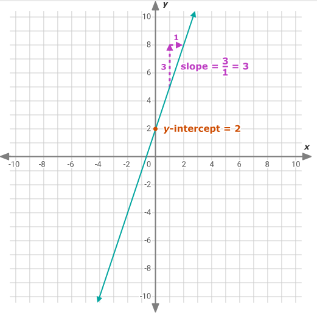
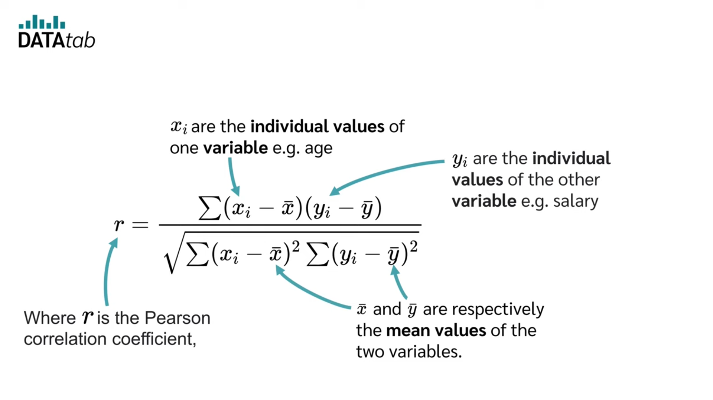
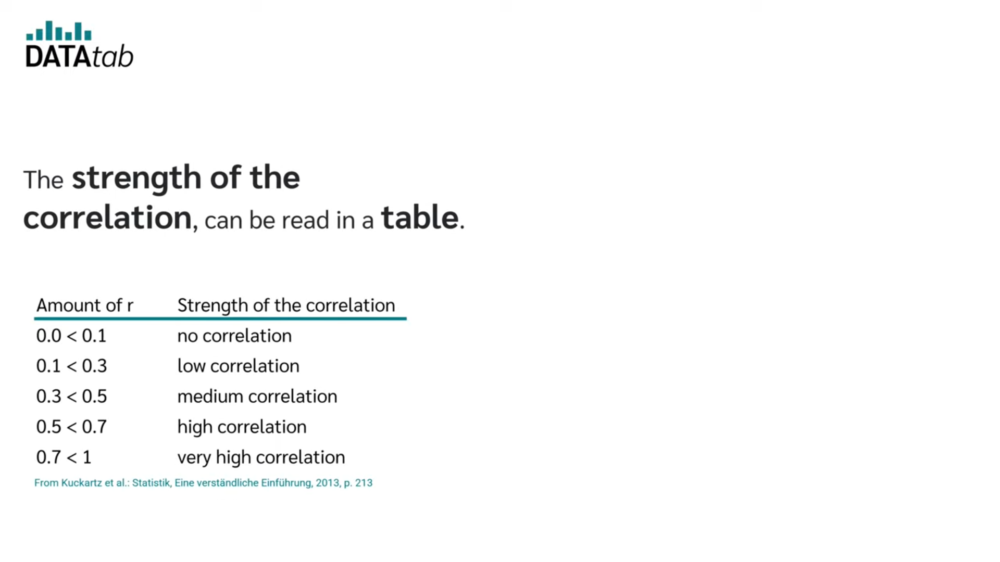

# Linear Stats

This Python program reads data from a file and calculates two key statistics: the **Linear Regression Line** and the **Pearson Correlation Coefficient**. The data file contains one value per line, which represents the y-values of a graph, while the x-values are the line numbers (starting from 0).

The program expects the data to be provided in a file where each line contains a single number, like this:

```
189
113
121
114
145
110
...
```

Example of the program output:

```
Linear Regression Line: y = 3.456789x + 1.234567
Pearson Correlation Coefficient: 0.9876543210
```

## Usage

1. Make sure [Python](https://www.python.org/downloads/) is installed on your system (version 3.6 or higher).
2. Install the required dependencies:
```bash
pip install numpy scipy
```
3. run the program, using:
```python
python3 app.py data.txt
```

## Testing

To test the program, [download this file](https://assets.01-edu.org/stats-projects/stat-bin-dockerized.zip), extract it, and copy the **bin** folder to the root of this project. Then, run `./bin/linear-stats` followed by `python3 app.py data.txt`, and compare the results of the tester with my program. The downloaded program modifies `data.txt` each time it runs, so feel free to test multiple times. Happy testing!

## Concepts

### Linear Regression Line

<div style="display: flex; height: 500px;">
    
    
</div>

### Pearson Correlation Coefficient

<div style="display: flex;">
    
    
</div>